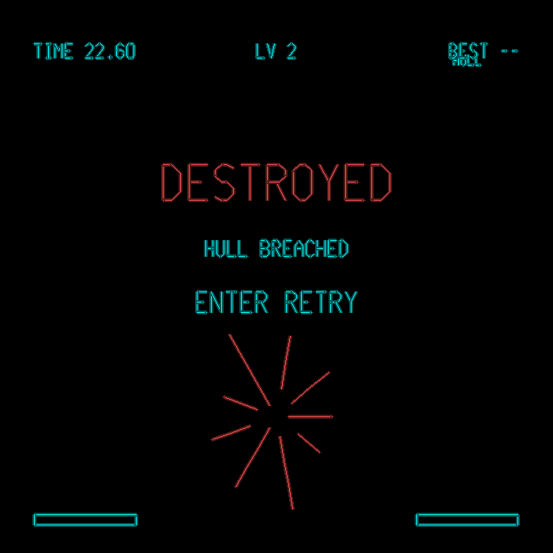
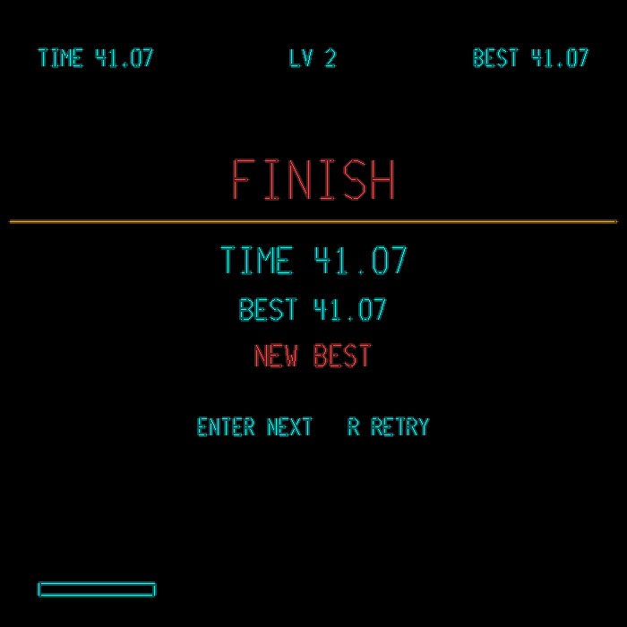
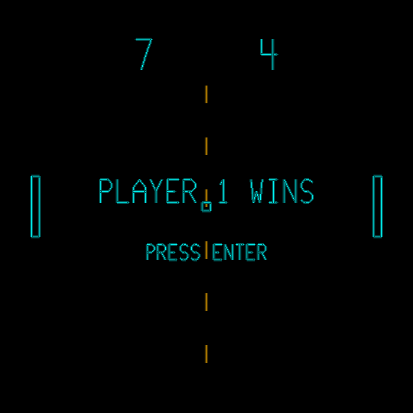
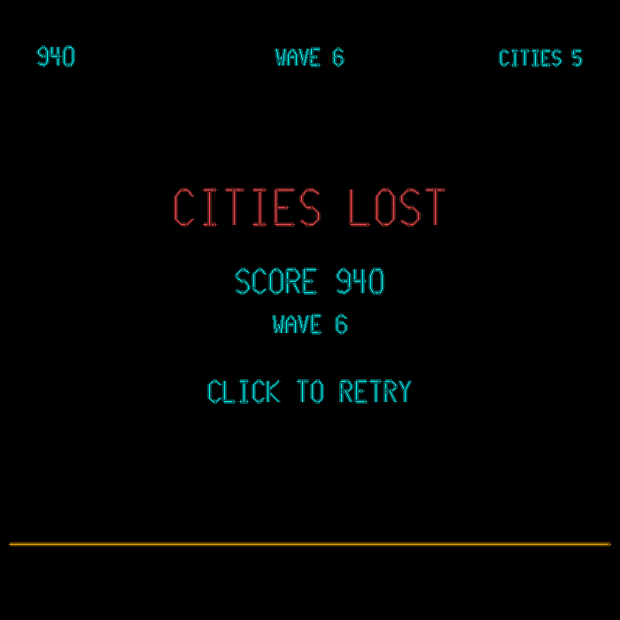
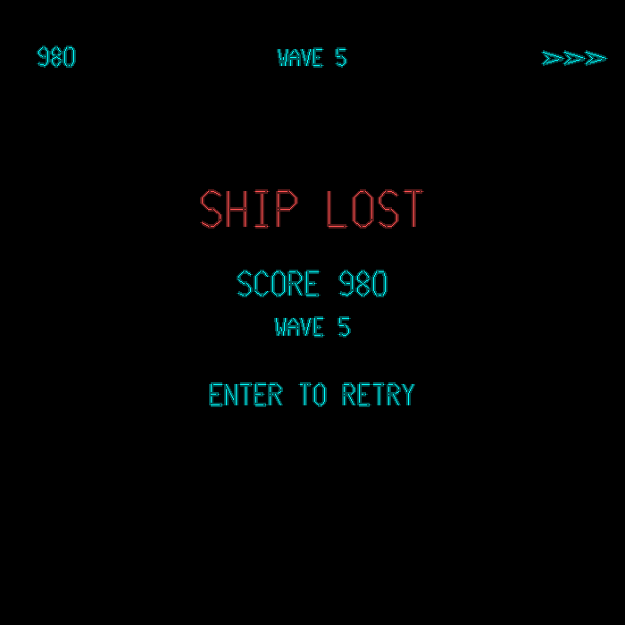
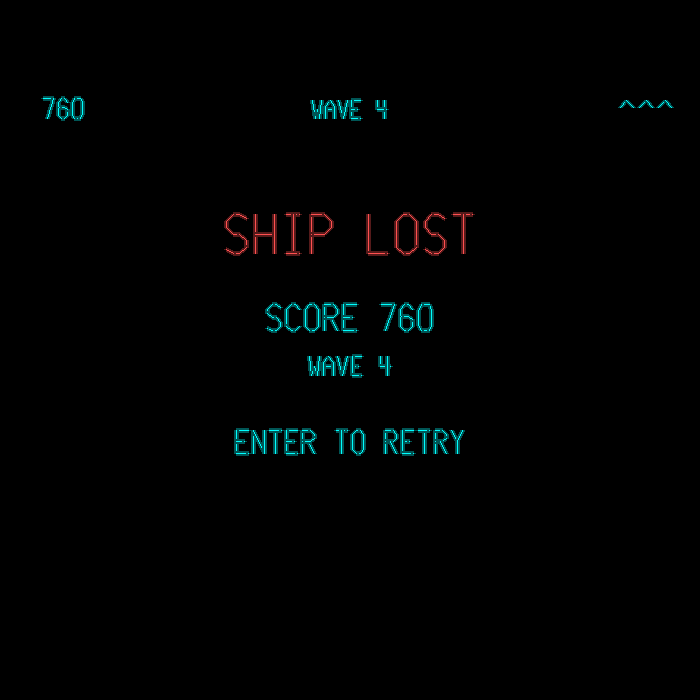

# Laser Arcade

A tiny **arcade for a laser projector**. Vector games drawn as a stream of galvo
points and streamed to a [Helios DAC](https://bitlasers.com/helios-laser-dac/),
with a laser-drawn menu to switch between them. Everything runs on an on-screen
simulator too, so you can build and play without hardware in front of you.

(Note: I've been wanting to play games big outside for years, this has been created with Claude.ai, as coding this is far beyond my abilities.) 

Shoutouts to the creators of the those orginal games and the technicians who designed and built the actual hardware too. I know the games in this project are still massive (eg 30-60kb) compared to what they were back in the day. Hats off. AI couldn't have built any of this if that code and all the open source awesomeness wasn't available. Don't make money from this, just use it and have fun.

Seven games (currently):

- **Asteroids** — the classic, rebuilt from scratch as vectors (thrust, wrap,
  splitting rocks, saucers, hyperspace, per-wave heartbeat).
- **Pong** — 2-player, paddle-angle deflection, ball speeds up through a rally,
  first to 7.
- **Slipstream** — a Wipeout-style hover racer down a receding wireframe track,
  with banking bends, sharp hairpins, crests and ramps over gaps, obstacles to
  dodge, and a drift-brake to slide the tight corners. Grinding walls and hitting
  obstacles damage your hull — run it to zero and you're wrecked. Time-trial that
  gets longer and gnarlier every level.
- **Missile Command** — mouse-driven: aim a crosshair and click to detonate
  counter-missiles in the path of incoming fire, defending a row of cities
  through endless, escalating waves, each announced by a short pause.
- **Gyruss** — a radial tunnel shooter. Your ship orbits a ring near the edge of
  the screen, firing inward; enemies spawn at the centre and spiral outward to a
  formation ring, then peel off and dive at you. Endless escalating waves, three
  lives.
- **Defender** — a side-scrolling rescue mission over a wraparound world (fly
  far enough and you come back around where you started), with real jagged
  mountain terrain and a touch of inertia to the flight. Protect the humans on
  the ground from Landers that try to carry them off; shoot a Lander to free
  whoever it's carrying, or lose them for good if it reaches the top.
- **Snake** — the classic. Steer around the field eating food to grow, speeding
  up as you go; run into a wall or yourself and it's over.


The interesting part isn't the games — it's the shared **engine** that turns
shapes into a scanner-friendly point stream (interpolation, corner dwell,
blanked slews, adaptive density) so the beam looks clean instead of smeared.
Adding an eighth game is a small subclass; see *Adding a game* below.

| Asteroids | Pong | Slipstream |
|---|---|---|
|  |  |  |

| Missile Command | Gyruss | Defender |
|---|---|---|
|  |  |  |

| Snake |
|---|
|  |


## Requirements

- Python 3.9+
- `pygame` (window, input, audio) and `numpy` (geometry + sound synthesis)
- A Helios DAC only if you want real laser output; otherwise the simulator is
  the default.

## Install

Use a virtual environment so the dependencies stay isolated from your system
Python:

```bash
cd laser-arcade
python -m venv .venv
source .venv/bin/activate         # Windows: .venv\Scripts\activate
pip install -r requirements.txt
```

Each new terminal, re-activate with `source .venv/bin/activate` before running.
(You'll see `(.venv)` at the start of your prompt when it's active.) When you're
done, `deactivate` returns to the system Python.

## Run

```bash
python run.py                          # menu, on-screen simulator
python run.py --laser                  # menu, streaming to the Helios (falls back to sim if no DAC)
python run.py --game pong              # jump straight into a game
python run.py --game pong --laser --invert-x --pps 11000 --max-step 35
```

If `--laser` can't find a DAC it prints why and drops back to the simulator, so
it always runs.

## Controls

**Menu**

The main menu is a carousel: one game shown at a time (name + a small icon),
so the laser only ever has to draw a single title instead of the whole list at
once — important at low PPS, where a long list of names all on screen together
can flicker.

| Key | Action |
|-----|--------|
| ← → / A D | cycle through games |
| ↑ ↓ / W S | move focus between the game carousel and the **CONFIG** button underneath |
| Enter / Space | launch the focused game, or open **CONFIG** |
| Esc | quit |

**Reserved everywhere (the shell handles these; games never see them)**

| Key | Action |
|-----|--------|
| Esc | in a game: back to the menu |
| P | pause / resume |
| Q | quit |

**Asteroids** — ← → / A D rotate, ↑ / W thrust, Space fire, Shift / H hyperspace,
Enter start / restart.

**Pong** — Player 1: **W / S**. Player 2: **↑ / ↓**. Enter serves (or just wait —
it auto-serves), and restarts the match when someone wins.

**Slipstream** — ← → / A D steer, ↑ / W accelerator, ↓ / S drift-brake (break
grip to slide through tight bends — bound by default to the same key as "down"
elsewhere, but it's its own **SLIPSTREAM BRAKE** entry in CONFIG, so you can
rebind it separately without touching any other game's down/descend key).
Enter starts and, at the finish, advances to the next (harder) track; **R**
retries the current track to beat your time. Steering matters: hold the gas
through a bend without turning and the centrifugal push pins you to the wall,
which scrubs your speed *and* grinds your **hull** down. Obstacles on the track
cost a big chunk of hull if you clip them, and missing a ramp drops you in the
gap. Run the hull to zero and you're destroyed — press Enter to retry. Your
best time per level is kept for the session.







**Missile Command** — **mouse only**. Move the mouse to aim the crosshair,
**click** to fire a counter-missile at that point; it detonates on arrival into
an expanding blast that destroys any enemy missile it catches. Click on the
title screen to start, and again to retry after your cities are wiped out.
There's a short cooldown between shots and a cap on missiles in flight, so
timing and blast placement matter more than clicking fast. Each wave opens with
a **2-second pause announcing "WAVE N"** so you can see the board before it
starts. Waves escalate fast: both the number of missiles *and* how many can be
in the air at once grow every wave, on top of faster spawns and faster
missiles — by wave 5 or so you're juggling considerably more than wave 1. Score
comes from kills plus a bonus for cities still standing at the end of each
wave; how many cities you have left is only shown by the skyline itself, not a
counter.



**Gyruss** — ← → / A D orbit around the ring, **Space** to fire inward (also
starts / retries). Enemies spiral out from the centre to a formation ring and
hold there, spinning, before some peel off and dive at your current position —
watch for the ones that flip to red, they're the threat. You get three lives,
with a moment of blink-invulnerability after each hit; lose all three and it's
game over. Score comes from kills plus a per-wave bonus, and waves get busier
the longer you last.



**Defender** — ← → / A D fly left/right (the world scrolls, wrapping around —
keep going one way and you come back where you started), ↑ / W / ↓ / S fly
up/down, **Space** to fire (also starts / retries) in whichever direction
you're currently facing. Horizontal flight has a bit of thrust and momentum —
release the key and the ship coasts and gradually slows rather than stopping
dead — while vertical stays direct, matching the original's controls. Landers
descend to grab a human and carry it upward; shoot one to kill it — if it's
carrying someone, they're rescued back to the ground, otherwise it's just a
kill. Let one reach the top of the screen with a human and they're gone for
good. Once every human is lost, new Landers spawn as fast, direct chasers
instead of hunting humans. Three lives, and waves escalate the longer you last.



**Snake** — ← → ↑ ↓ / A D W S steer, Enter starts / retries. Moves on a fixed
tick, not continuously — a turn you press takes effect on the next grid step,
and you can't reverse straight into yourself. Eating food grows you by one
segment and speeds the tick up a little (capped), so it gets tighter the
longer you survive. Hit a wall or your own tail and it's over; your best score
this session is shown alongside the current one.

## Config

Open **CONFIG** from the main menu (Down from the carousel, then Enter) for
settings that are saved to `~/.laser-arcade/config.json` and reloaded next
launch. Up/Down move, Left/Right change a value, Enter binds a key (or resets /
saves / toggles), Esc saves and returns.


- **Config Output** — whether the CONFIG screen itself is sent to the laser
  (**BOTH**) or kept to the on-screen preview only (**SCREEN ONLY**). The
  config screen is text-heavy and static, which is no trouble on a monitor but
  can be a lot for a low-PPS laser to sit through while you're just adjusting
  settings; this only affects the config screen itself, not the menu or any
  game. Left/Right or Enter toggles it.
- **PPS per game** — each game can have its own point rate. Handy because a busy
  game like Asteroids may want a lower rate for clean geometry while light Pong
  can run faster. Falls back to the `--pps` you launched with.
- **Key bindings** — rebind any gameplay action (steer, thrust/accel, fire,
  drift, hyperspace, retry, Slipstream's brake, and Pong's two players). Select
  the row, press Enter, then press the key you want. Note Slipstream's brake is
  its own entry, separate from the generic down/descend used elsewhere (e.g.
  Defender), so rebinding one doesn't affect the other. Esc, Q, P and Enter
  stay reserved for the shell.
- **Keystone H / V** — trapezoid correction for a projector that isn't square-on
  to the surface. **Keystone H** pre-widens or narrows the top relative to the
  bottom (for a projector tilted up/down); **Keystone V** does the same for left
  vs right (a projector offset sideways). **This only warps the DAC output — the
  on-screen preview is never touched**, so calibrate against the wall, then
  leave the preview as your true reference.


```
laser-arcade/
  run.py                    entry point + CLI
  engine/                   reusable, game-agnostic core
    config.py               all tunables (Settings)
    vec.py                  2-vector
    font.py                 stroke vector font (shared by games + menu)
    pathplan.py             scene -> scanner point stream (the clever bit)
    audio.py                synth primitives + a name-driven SoundBank
    game.py                 the Game interface + Scene/InputState types
    shell.py                window, outputs, and the menu / game / config loop
    keymap.py               remappable gameplay actions
    store.py                load/save the config JSON (~/.laser-arcade)
    outputs/                base / simulator / helios
  games/
    __init__.py             GAMES registry (menu order lives here)
    asteroids/              world.py, shapes.py, render.py, sfx.py + adapter
    pong/                   world.py, render.py, sfx.py + adapter
    slipstream/             world.py, render.py, sfx.py + adapter
    missile/                world.py, render.py, sfx.py + adapter (mouse input)
    gyruss/                 world.py, render.py, sfx.py + adapter
    defender/               world.py, render.py, sfx.py + adapter (wraparound world)
    snake/                  world.py, render.py, sfx.py + adapter
  tools/testpattern.py      calibration pattern
```

Three ideas hold it together:

- **A game is anything that implements `engine.game.Game`.** It advances its own
  simulation in `update(dt, input)`, hands back a `scene()` (world-space
  polylines + colour) to draw, and declares its sounds. It owns its own internal
  states (attract, serving, game-over); the shell only knows *menu vs game*.
- **The shell is generic.** It builds the menu, runs the selected game, routes
  input, plans each frame to points, and manages audio. It contains nothing
  game-specific.
- **The engine never mentions a game.** `pathplan`, `outputs`, `font`, `audio`
  and `config` know about lasers and drawing, not about ships or paddles.

Games are decoupled from raw keys by an `InputState` (which keys are `down()`
this frame, which were `hit()` as edges), so each game maps its own controls.

## Adding a game

Drop a package under `games/`, implement the interface, and register it. A
minimal game:

```python
# games/breakout/__init__.py
import pygame
from engine.game import Game, InputState, Scene

class BreakoutGame(Game):
    name = "BREAKOUT"
    key = "breakout"      # used for --game and the per-game PPS setting
    players = 1
    blurb = "LEFT RIGHT MOVE"
    icon = [[(-0.8, 0.6), (0.8, 0.6), (0.8, 0.3), (-0.8, 0.3), (-0.8, 0.6)],
            [(0.0, -0.6), (0.15, -0.4), (0.0, -0.2), (-0.15, -0.4), (0.0, -0.6)]]

    def start(self):
        self.world = BreakoutWorld()

    def update(self, dt: float, inp: InputState):
        km = self.cfg.keymap                # respects the player's rebound keys
        d = (1 if km.down(inp, "right") else 0) - (1 if km.down(inp, "left") else 0)
        self.world.step(dt, d, launch=km.hit(inp, "fire"))

    def scene(self, t: float) -> Scene:
        return render_breakout(self.world, self.cfg, t)   # [(polyline, colour), ...]

    # optional: sound_spec() -> (one_shots, loops); audio_events(); active_loops()
```

Prefer `self.cfg.keymap.down(inp, "action")` / `.hit(inp, "action")` over raw key
codes so the player's CONFIG rebindings apply automatically; see `engine/keymap.py`
for the action names. For a mouse-driven game (Missile Command is the example),
`inp.mouse_pos` is a world-space `(x, y)` or `None`, and `inp.mouse_down` /
`inp.mouse_click` mirror `down()`/`hit()` for the primary button — the shell
hides the OS cursor during play, so draw your own crosshair from `mouse_pos`.
`icon` is optional but recommended: a short list of polylines in local space
roughly bounded to `[-1, 1]`, shown in the main menu carousel above the game's
name. Skip it and the carousel just shows the name with no pictogram.

Then add it to the registry:

```python
# games/__init__.py
from .breakout import BreakoutGame
GAMES = [AsteroidsGame, PongGame, SlipstreamGame, MissileGame, GyrussGame, DefenderGame, SnakeGame, BreakoutGame]
```

It now appears in the menu and is launchable with `--game breakout`. Use
`self.cfg.beam(colour)` for every colour so `--mono` / `--brightness` keep
working, and keep coordinates in the `[-1, 1]` world square.

## Helios DAC setup (for real laser output)

The shared library is loaded at runtime via `ctypes`; it is **not** a pip
dependency. Put `libHeliosDacAPI.so` next to `run.py` and it's found
automatically (the loader also checks the current directory and `~/.local/lib`).
Until it's there, `--laser` prints `[helios] shared library not found` and falls
back to the simulator — that message is expected, not a crash.

**Already had it working for Laser Asteroids?** Copy that same file across:

```bash
cp ~/snap/laser-asteroids/libHeliosDacAPI.so ~/snap/laser-arcade/
```

**Or use the prebuilt library.** The repo ships an x86-64 build:

```bash
git clone https://github.com/Grix/helios_dac
cp helios_dac/sdk/examples/python/libHeliosDacAPI.so .   # into the laser-arcade folder
```

**Or build from source.** Mind the current repo layout: the flat C-API wrapper
lives in `shared_library/`, and `HeliosDac.cpp` pulls in the `idn/` sources, so
those must be compiled and linked too (miss them and you get file-not-found or
undefined-reference errors). Build from `sdk/cpp`:

```bash
sudo apt install libusb-1.0-0-dev        # provides the -lusb-1.0 link symlink
cd helios_dac/sdk/cpp
g++ -std=c++14 -fPIC -O2 -I. -c HeliosDac.cpp
g++ -std=c++14 -fPIC -O2 -I. -c idn/idn.cpp
g++ -std=c++14 -fPIC -O2 -I. -c idn/idnServerList.cpp
g++ -std=c++14 -fPIC -O2 -I. -c idn/plt-posix.cpp
g++ -std=c++14 -fPIC -O2 -I. -I.. -c shared_library/HeliosDacAPI.cpp
g++ -shared -o libHeliosDacAPI.so *.o -lusb-1.0
# copy libHeliosDacAPI.so into the laser-arcade folder (or a system lib dir)
```

USB access without root, via udev:

```bash
# /etc/udev/rules.d/99-helios.rules
ACTION=="add", SUBSYSTEM=="usb", ATTRS{idVendor}=="1209", ATTRS{idProduct}=="e500", MODE="0660", GROUP="plugdev"
```

```bash
sudo udevadm control --reload-rules && sudo udevadm trigger
```

The config tries `libHeliosDacAPI.so` and `libHeliosLaserDAC.so` (with and
without a `./` prefix). Newer SDK builds also want `libusb-1.0.so` alongside.

## Calibrate first

Stream the test pattern and sort out scale / offset / orientation on your galvo
amp before playing:

```bash
python tools/testpattern.py --laser
# add --invert-x / --invert-y / --swap-xy / --fill 0.9 until the square is
# square, the circle is round, and the doubled corner tick is top-right.
```

Then carry the same flags to `run.py`. The on-screen preview stays upright no
matter which orientation flags you set, so it never mirrors when you flip the
beam for your optics.

## Scanner tuning guide

Everything lives in `engine/config.py`; the most useful are also CLI flags. All
distances are in DAC units (the field is `0..4095`).

| Setting / flag | What it does |
|---|---|
| `--pps` | Points per second to the DAC. Higher = less flicker, but your galvos have a ceiling (cheaper scanners ~20–30k). |
| `--fps` / `target_fps` | Frame build rate. The planner budgets **total points ≈ pps/fps**, so these two together cap how much detail a frame holds before it auto-coarsens. |
| `--max-step` | Finest gap between lit points. Smaller = brighter, straighter lines and more points; larger = fewer, faster, fainter. It's a floor — the planner only ever goes *coarser* when busy. |
| `corner_dwell` | Points held at corners so mirrors settle instead of rounding them. Raise if corners look mushy; it costs points. |
| `start_dwell` / `end_dwell` | Points held at each shape's start/end so the beam doesn't smear on/off. |
| `blank_dwell` / `blank_step` | Beam-off jumps between shapes. Raise `blank_dwell` if faint "tails" appear before a mirror arrives; lower `blank_step` if long jumps leave tails. |
| `--fill` | Field usage (0..1). Leave a border so you don't slam the galvo rails. |
| `--invert-x/-y`, `--swap-xy` | Orientation, per your projector. DAC only; the preview stays upright. |
| `--mono` / `--brightness` | Single-colour output / global colour scale. |
| `--show-blanking` | Draw the beam-off travel faintly in the simulator. |

Rule of thumb for a scanner rated *N* kpps: start `--pps` at ~0.8·N,
`--max-step 40`, `corner_dwell 1`. If corners round off, raise `corner_dwell`. If
it flickers, raise `--pps` or lower `--fps`, or accept a larger `--max-step`.
Pong is very light (a few hundred points a frame), so it stays flicker-free even
at conservative point rates; Asteroids is heavier when the field is full.

## Troubleshooting

- **`[helios] shared library not found` / falls back to the simulator** — the
  Helios library isn't beside `run.py`. Copy `libHeliosDacAPI.so` into the folder
  (see *Helios DAC setup*). The message lists exactly which directories it
  searched.
- **Loaded but "no DAC found"** — the library is fine but the device isn't
  visible: check the udev rule, the USB cable, and `--device` if you have more
  than one Helios.
- **`RuntimeWarning: ... avx2 capable but pygame was not built with support`** —
  harmless. It's a performance note from the prebuilt pygame wheel, not an error;
  the game runs fine.
- **Preview looks mirrored on the wall** — that's the calibration flags doing
  their job on the DAC; the preview is deliberately kept upright. Adjust
  `--invert-x/-y` / `--swap-xy` against the wall, not the screen.
- **Corners rounded / lines smeared** — lower `--pps` or raise `--max-step` (your
  scanners are being asked for more than they can track), then nudge dwell.

## Licence / credits

MIT licensed — see [LICENSE](LICENSE). Helios DAC and SDK by Gitle Mikkelsen
(Grix); udev/build notes per bitlasers.com. Asteroids, Pong, Missile Command,
Gyruss, Defender and Snake are homages to their respective arcade originals.
