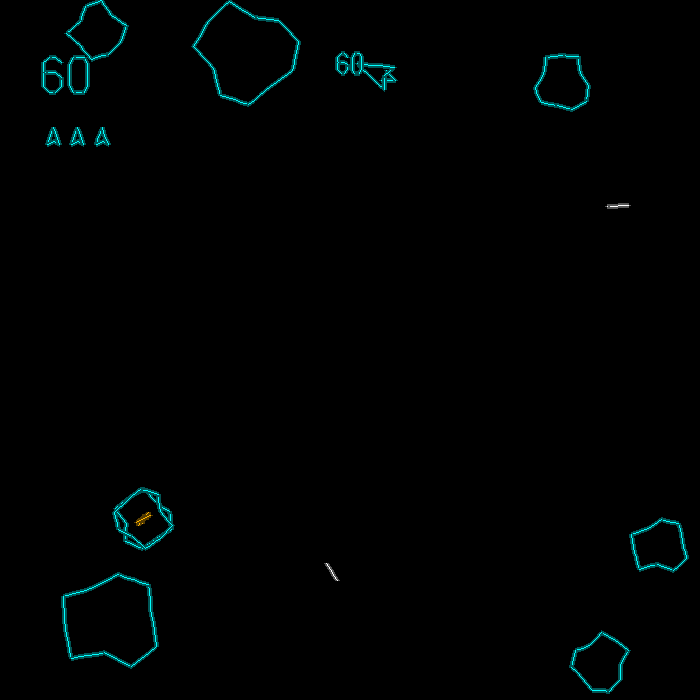
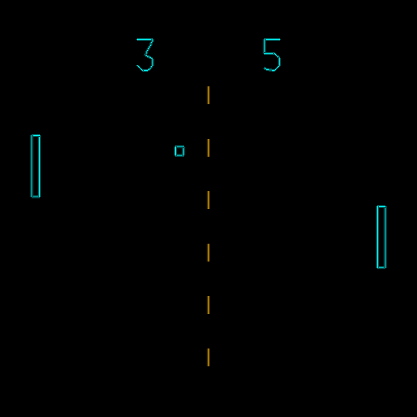
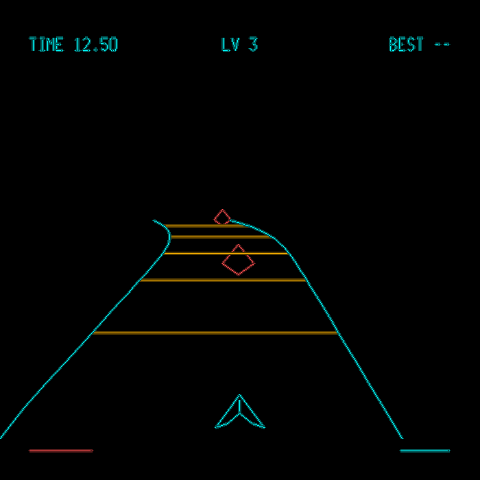
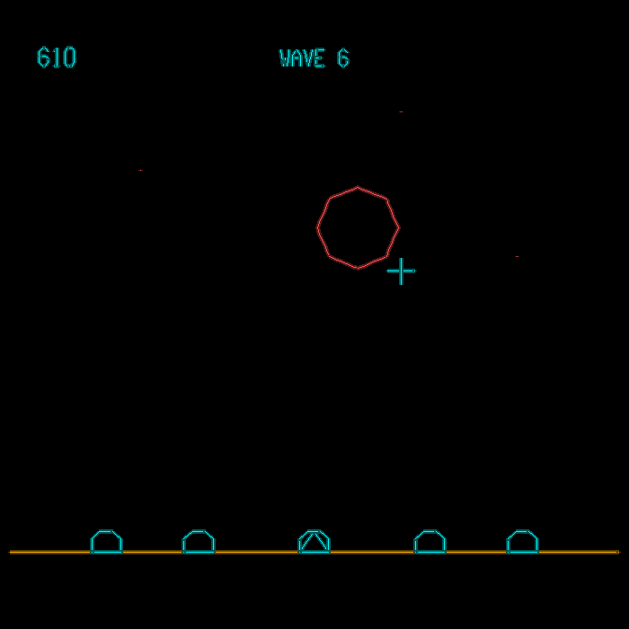
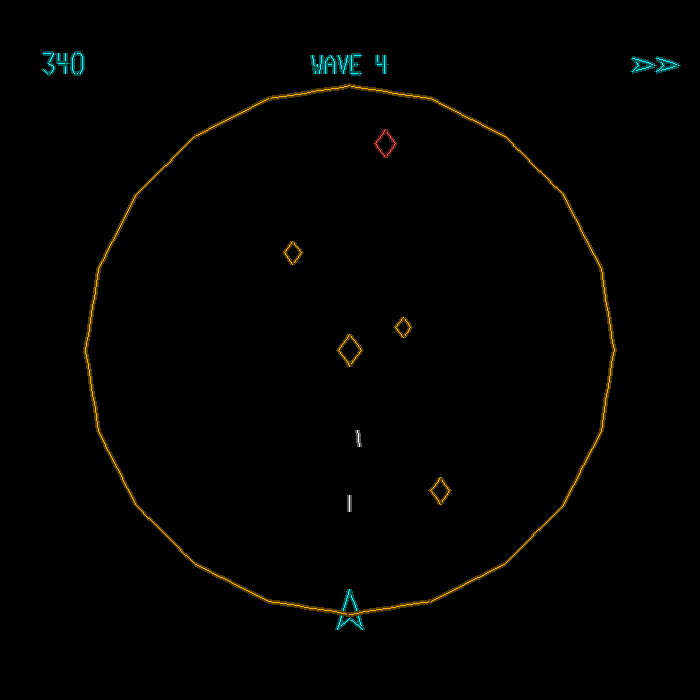
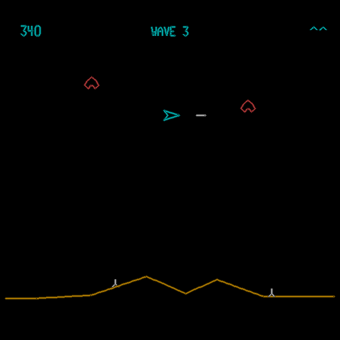
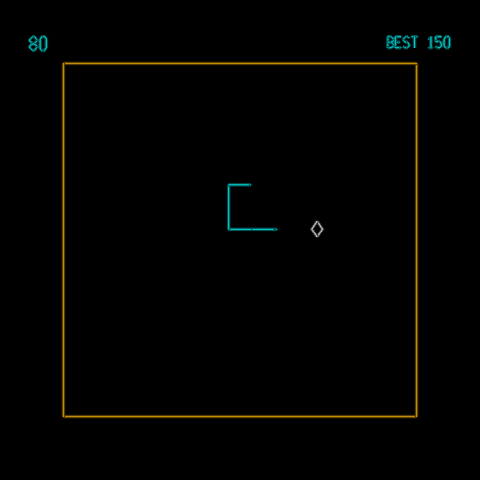
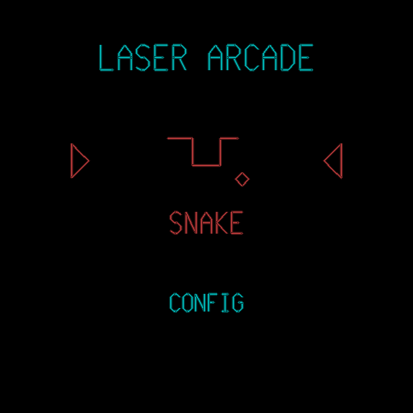
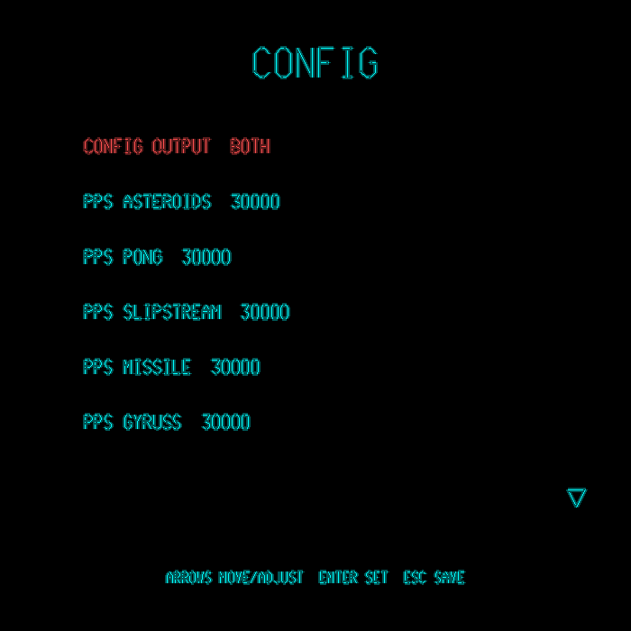

# Laser Arcade

[](https://github.com/edmonkey-nz/laser-arcade/actions/workflows/build.yml)
[](https://github.com/edmonkey-nz/laser-arcade/releases/latest)
[](https://github.com/edmonkey-nz/laser-arcade/releases/latest)
[](https://www.python.org/)
[](LICENSE)

A tiny **arcade for a laser projector**. Vector games drawn as a stream of galvo
points and streamed to a [Helios DAC](https://bitlasers.com/helios-laser-dac/)
or a **LaserCube over the network**, with a laser-drawn menu to switch between
them. Everything runs on an on-screen simulator too, so you can build and play
without hardware in front of you.

> I've been wanting to play games big outside for years. This was created with
> Claude.ai — with many hours crafting, testing and orchestrating by a human.
>
> Shoutouts to the creators of the original games and the technicians who
> designed and built the actual hardware. Hats off. AI couldn't have built any
> of this if that code and all the open source awesomeness wasn't available.
> Don't make money from this, just use it and have fun.

| Asteroids | Pong | Slipstream |
|---|---|---|
|  |  |  |

| Missile Command | Gyruss | Defender |
|---|---|---|
|  |  |  |

| Snake | Menu | Config |
|---|---|---|
|  |  |  |

## The games

- **Asteroids** — thrust, wrap, splitting rocks, saucers, hyperspace.
- **Pong** — 2-player, paddle-angle deflection, first to 7.
- **Slipstream** — a Wipeout-style hover racer down a wireframe track. Time
  trial; gets longer and gnarlier every level.
- **Missile Command** — aim a crosshair, detonate counter-missiles, defend your
  cities through escalating waves.
- **Gyruss** — radial tunnel shooter; you orbit the edge and fire inward.
- **Defender** — side-scrolling rescue over a wraparound world.
- **Snake** — eat, grow, speed up, don't bite yourself.

## Download

Prebuilt executables for Linux, Windows and macOS are on the
[releases page](https://github.com/edmonkey-nz/laser-arcade/releases/latest) —
no Python needed. Unpack and run `laser-arcade`.

For Helios output, put your shared library (`libHeliosDacAPI.so`,
`HeliosLaserDAC.dll`, or the `.dylib`) **next to the executable**; see
[TECHNICAL.md](TECHNICAL.md). A LaserCube needs no library — it is driven over
Ethernet. Without either, the app runs on the on-screen simulator.

## Install from source

Python 3.9+, plus `pygame` and `numpy`. A DAC is only needed for real laser
output — the simulator is the default.

```bash
cd laser-arcade
python -m venv .venv
source .venv/bin/activate         # Windows: .venv\Scripts\activate
pip install -r requirements.txt
```

## Run

```bash
python run.py                        # menu, on-screen simulator
python run.py --output helios        # stream to a Helios DAC
python run.py --output lasercube     # stream to a LaserCube over the network
python run.py --game pong            # jump straight into a game
python run.py --selftest             # headless check: games + laser safety layer
python run.py --version
```

(Running a downloaded build? Use `./laser-arcade` in place of `python run.py`.)

If a device can't be opened it prints why and drops back to the simulator, so it
always runs. `--laser` still works as an alias for `--output helios`.

> ### ⚠️ Read [SAFETY.md](SAFETY.md) before connecting a projector
>
> Laser output always starts **DISARMED** with the brightness ceiling at **5%**,
> every launch, and neither is remembered. Press **`Shift-.`** twice to arm and
> **`.`** to disarm — from the keyboard only.
>
> **A gamepad cannot arm the laser, disarm it, open the config screen, or touch
> the brightness ceiling.** On a cabinet the pad is the public's control and the
> keyboard is the operator's. Put the keyboard somewhere the public can't reach.
>
> None of this is a safety device. The key switch, shutter, interlock loop,
> Remote Stop and correct eyewear are.

## Controls

The menu is a carousel — one game at a time, so the laser only ever draws a
single title.

| Key | Action |
|-----|--------|
| ← → / A D | cycle games |
| ↑ ↓ / W S | move between the carousel and **CONFIG** |
| Enter / Space | launch, or open CONFIG |
| Esc | back to the menu from a game; quit from the menu |
| P | pause |
| **`.`** | **DISARM the laser** — instant, from anywhere |
| **`Shift-.`** | **ARM the laser** — press twice to confirm |

The last two, plus **Q** (quit) and the whole **CONFIG** screen, are
**keyboard-only**: a gamepad can play games and back out of them, and that is
all. See [SAFETY.md](SAFETY.md) §3.
| Q | quit |

In game: **arrows / WASD** move, **Space** fires, **Shift** is the alternate
action (Asteroids hyperspace), **R** retries. Missile Command uses the mouse —
move to aim, click to fire.

**Gamepads work too**, alongside the keyboard, and are tested against both a
generic USB pad and a DualShock 4:

| Control | Action |
|---|---|
| D-pad / either stick | steer |
| Cross (button 0) | fire — also starts a game |
| Circle (button 1) | alternate / hyperspace |
| Options, or button 6 | back to the menu |
| Share, or button 10 | retry |

In Pong the **left stick is player 1 and the right stick is player 2**, so two
people can share one pad; in Missile Command the left stick moves the crosshair
and fire clicks.

Quitting is deliberately keyboard-only, so nobody can drop a cabinet to the
desktop mid-game.

USB or Bluetooth both work — the app just uses whatever the OS exposes as a
joystick, and pads can be plugged or unplugged while it's running. Several pads
can be connected at once; their input is combined, and the default button map
covers generic USB pads and DualShock 4s together, so you can mix them.

Pads disagree wildly about button numbering. If yours is mapped wrongly, run
`python controller_test.py`, press the buttons you care about, and put the
numbers it prints into `DEFAULT_BUTTON_MAP` in [`engine/joystick.py`](engine/joystick.py).
Stick axes are detected automatically. If a Bluetooth pad pairs but never shows
up, see the troubleshooting notes in [TECHNICAL.md](TECHNICAL.md) — that's
usually BlueZ refusing an unbonded HID connection, before the app is involved.

## Config

**CONFIG** from the main menu (Down from the carousel, then Enter). **Keyboard
only** — a gamepad can neither open it nor drive it. Saved to
`~/.laser-arcade/config.json` and reloaded next launch.

- **Laser** — ARM / DISARM. Arming asks for a second press.
- **Max brightness** — the hard cap on output power, 5% by default. The first
  press that would take it above 5% asks for confirmation; after that it just
  adjusts. It is **not saved**: every launch starts back at 5%. See
  [SAFETY.md](SAFETY.md).
- **Reset max brightness = 5** — snaps it straight back to bring-up power.
- **Laser device** — none / Helios / LaserCube, switchable live. Switching
  always disarms.
- **Test device** — what the attached device reports about itself: temperature,
  interlock, buffer, firmware. Emits nothing.
- **Config Output** — `SCREEN ONLY` by default: the config screen is text-heavy
  and hard work at low PPS, and there's no reason to paint a wall of text with
  the beam. Switch it to `BOTH` if you want it on the laser.
- **PPS per game** — each game can have its own point rate.
- **Key bindings** — rebind any gameplay action. Esc, Q and P stay reserved.
- **Keystone H / V** — trapezoid correction for a projector that isn't square-on.
  Warps the DAC output only; the preview stays true.
- **Reset highscores** — clears them all. Asks for a second press to confirm.

High scores are kept per game in `~/.laser-arcade/highscores.json`. Pong (two
players) and Slipstream (a time trial) don't have one.

## More

- **[SAFETY.md](SAFETY.md)** — what the software does and does not protect you
  from, the daily operating procedure, and how to bring up new hardware. Read it
  before connecting a projector.
- **[TECHNICAL.md](TECHNICAL.md)** — architecture, input provenance, the laser
  output layer, adding a game, DAC setup, calibration, scanner tuning and
  troubleshooting.
- **[CLAUDE.md](CLAUDE.md)** — the short version of the constraints, for anyone
  (or anything) changing the code.
- **[PORTING.md](PORTING.md)** / **[lasercubeoutput.md](lasercubeoutput.md)** —
  the shared output layer's own design notes, carried from upstream.

## Licence / credits

MIT licensed — see [LICENSE](LICENSE). Helios DAC and SDK by Gitle Mikkelsen
(Grix); udev/build notes per bitlasers.com. Asteroids, Pong, Missile Command,
Gyruss, Defender and Snake are homages to their respective arcade originals.
